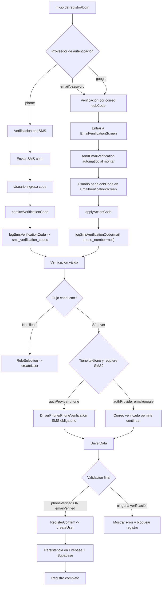

# Auth Verification Flow (SMS + Email)

```mermaid
flowchart TD
  A[Inicio de registro/login] --> B{Proveedor de autenticación}

  B -->|phone| C[Verificación por SMS]
  B -->|email/password| D[Verificación por correo oobCode]
  B -->|google| D

  C --> C1[Enviar SMS code]
  C1 --> C2[Usuario ingresa code]
  C2 --> C3[confirmVerificationCode]
  C3 --> C4[logSmsVerificationCode -> sms_verification_codes]
  C4 --> E[Verificación válida]

  D --> D1[Entrar a EmailVerificationScreen]
  D1 --> D1A[sendEmailVerification automatico al montar]
  D1A --> D2[Usuario pega oobCode en EmailVerificationScreen]
  D2 --> D3[applyActionCode]
  D3 --> D4["logSmsVerificationCode(mail, phone_number=null)"]
  D4 --> E

  E --> F{Flujo conductor?}

  F -->|No cliente| G["RoleSelection -> createUser"]

  F -->|Sí driver| H{Tiene teléfono y requiere SMS?}
  H -->|authProvider phone| I["DriverPhone/PhoneVerification SMS obligatorio"]
  I --> J[DriverData]

  H -->|authProvider email/google| K[Correo verificado permite continuar]
  K --> J

  J --> L{Validación final}
  L -->|phoneVerified OR emailVerified| M["RegisterConfirm -> createUser"]
  L -->|ninguna verificación| N["Mostrar error y bloquear registro"]

  M --> O[Persistencia en Firebase + Supabase]
  O --> P[Registro completo]
```
